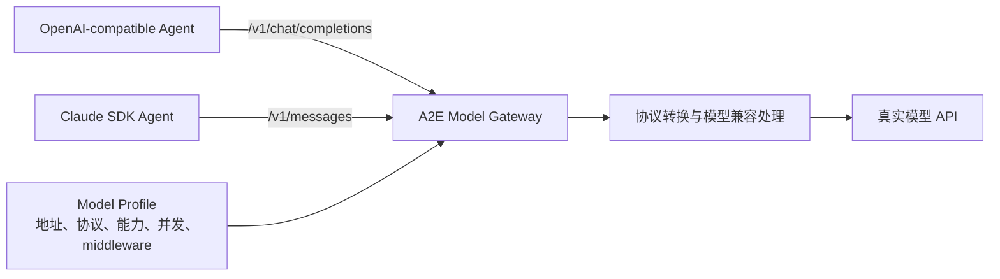
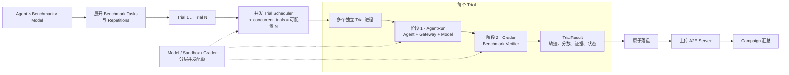

# 当前分支新增设计：Gateway 与并发 Trial

| 项目 | 内容 |
| --- | --- |
| 更新时间 | 2026-08-25 12:41:21（UTC+08:00，CST） |
| 当前分支 | `codex/concurrency-logic` |
| 设计范围 | 只说明 Gateway 模型配置与 Harbor 风格并发 Trial 两项新增设计 |

## 1. 参考 SAfactory 引入 Gateway，统一解决模型配置与兼容问题

[SAfactory](https://github.com/AI45Lab/SAfactory) 把模型调用统一路由到 OpenAI-compatible Gateway：Agent 只连接 Gateway 和一个逻辑模型名，真实的模型地址、密钥、流式能力与最大并发由 Gateway route 管理。A2E 参考的是这层解耦思路，而不是直接复制 SAfactory 的实现。

### 原来的问题

没有 Gateway 时，每个 Agent 都要直接处理模型配置：

```text
Agent → model / api_base / api_key / protocol
```

这会产生三个问题：

1. 同一个模型的地址、密钥环境变量和参数散落在不同 Agent 启动脚本中。
2. Agent 使用的协议不一致。例如 OpenAI Agents 使用 Chat Completions，Claude SDK 使用 Anthropic Messages，同一模型不能直接复用。
3. 模型的能力、并发限制和特殊兼容逻辑没有统一配置，也无法稳定写入 Campaign 锁文件。

新增 Gateway 后，调用关系变为：



Agent 只接收 Gateway 返回的统一 `model + base_url + api_key`，模型差异集中在 [`task/models/`](../task/models/) 和 [`ageneval-model-gateway`](../task/packages/ageneval-model-gateway/) 中。

### GLM 的具体例子

GLM-5.3 的上游接口是 OpenAI Chat Completions，但实际批量 Agent 运行中存在以下问题。

**问题一：Claude SDK 与 GLM 的协议不一致。**

Claude SDK 发出 Anthropic `/v1/messages` 请求，GLM 上游接收 `/v1/chat/completions`。如果没有 Gateway，就需要为 Claude SDK 单独写 GLM 适配代码。现在 Gateway 在同一个本地端口同时暴露两种接口，并转换：

- system、user、assistant 消息；
- Anthropic `tool_use/tool_result` 与 OpenAI `tool_calls/tool`；
- `stop_reason`、token usage 和错误响应；
- 普通响应与流式 SSE 事件。

因此 Claude SDK、OpenAI Agents、LangGraph 等 Agent 可以共享同一个 GLM Model Profile。

**问题二：带工具调用的 assistant 消息可能包含 `content: null`。**

部分 OpenAI-compatible 客户端会发送：

```json
{
  "role": "assistant",
  "content": null,
  "tool_calls": [{"id": "call_1", "type": "function"}]
}
```

GLM 兼容链路可能拒绝这种消息。`glm_tool_call_compat` 只对目标模型把 `content: null` 规范化为 `content: ""`，不修改其他模型的请求。

**问题三：GLM 工具参数偶尔出现两个 JSON 对象拼接。**

实际响应中观察到类似：

```text
{}{ "command": "pwd" }
```

它不是合法的函数参数 JSON，会导致 Agent 无法执行工具。Gateway 会在普通 JSON 响应和跨多个 SSE chunk 的流式响应中识别这一确定模式，移除前导空对象，得到：

```json
{"command": "pwd"}
```

修复只处理“空对象 + 一个非空对象”这一已知模式；多个非空对象或其他模糊坏数据不会被猜测性修改。

GLM 的配置最终集中为一个 Profile：

```yaml
id: glm-5.3
model: glm-5.3
upstream_protocol: openai_chat_completions
connection:
  base_url_env: GLM_API_BASE
  api_key_env: GLM_API_KEY
concurrency:
  group: zai-glm
  max_sessions: 32
gateway:
  interfaces:
    - openai_chat_completions
    - anthropic_messages
middleware:
  - glm_tool_call_compat
```

这样解决的是“模型配置和兼容逻辑归谁管理”的问题：Agent 不再知道真实上游差异；Profile 管配置，Gateway 管协议与兼容，Controller 管生命周期。锁文件只保存环境变量名和 Profile 摘要，不保存真实密钥。

## 2. 参考 Harbor，把 `Agent × Benchmark × Model` 展开为 Trial 并发执行

[Harbor](https://www.harborframework.com/docs/core-concepts) 的核心抽象是：Trial 表示一个 Agent 对一个 Task 的一次尝试；Job 可以包含多个 Agent、Benchmark/Dataset、Task 和 Model，并在运行前生成一组 Trial 并行执行。A2E 参考这一思路，把原来的单次实验调用提升为 Campaign 级 Trial 调度。

### Trial 如何构建

业务入口先组合：

```text
Agent × Benchmark × Model
```

Benchmark 内包含多个 Task，再结合重复次数展开为真正可执行的 Trial：

```text
Trial = Agent × Benchmark.Task × Model × Repetition
```

当前代码中 `harnesses` 字段就是 Agent 运行实现这一维。`Agent × Benchmark × Model` 先形成 Cell，每个 Cell 再按选中的 Task 和 repetition 生成多个稳定 `trial_id`。

例如：

```text
2 Agents × 1 Benchmark × 2 Models × 81 Tasks × 1 Repetition
= 324 Trials
```

这些 Trial 在开始运行前已经确定，因而可以稳定恢复、补跑失败项并对齐不同 Agent/Model 的结果。

### Trial 如何并发

Controller 把所有待执行 Trial 放入统一调度队列。`n_concurrent_trials` 可以设置为任意正整数，每个 Trial Attempt 使用一个独立操作系统进程，因此同步 Agent SDK、Docker 命令或单个 Trial 崩溃不会阻塞其他 Trial。

“任意并发”表示调度并发度可配置，不表示没有资源上限。实际同时运行数还会受到以下独立配额约束：

- Model Profile 的 `max_sessions`；
- Campaign 的 Sandbox 并发数；
- Grader 并发数；
- 上传并发数；
- 本机或集群的 CPU、内存和容器容量。

### 每个 Trial 只有两个主阶段

1. **AgentRun**：创建或进入 Benchmark 环境，Agent 通过 Gateway 调用指定 Model，执行工具并产出答案与轨迹。
2. **Grader**：AgentRun 结束后执行 Benchmark 对应的 verifier/grader，产出分数、解释和审计证据。

主流程如下：



关键点是：并发单位是 Trial，不是 Agent，也不是 Benchmark。多个 Trial 可以同时处于 AgentRun，也可以有一部分进入 Grader；Controller 分别控制完整 Trial、模型调用、Sandbox 和 Grader 的并发，因此既能充分并行，又不会让某一种资源被打满。

### 重要并发参数

| 参数 | 作用范围 | 含义 | 默认值与约束 |
| --- | --- | --- | --- |
| `execution.n_concurrent_trials` | 整个 Campaign | 同时处于执行、重试或结果处理生命周期中的 Trial 上限，是最外层的总并发开关 | 默认 `3`，必须为正整数 |
| `execution.n_active_cells` | 调度窗口 | 一个轮询窗口内同时参与投递的 Cell 数；用于避免一次加载过多组合，不等于 Trial 进程数 | 默认 `2`，必须为正整数 |
| `execution.n_concurrent_model_sessions` | 全部模型 | 所有模型组加总后的 AgentRun 会话上限 | 默认不设置；不设置时使用各模型组上限之和 |
| `ModelProfile.concurrency.max_sessions` | 单个模型组 | 同一 provider/model 并发组允许的 AgentRun 会话数，例如限制 GLM 同时请求数 | 必须为正整数；GLM 示例为 `32` |
| `execution.n_concurrent_sandboxes` | Environment/AgentRun/Grader | 同时存活的 Sandbox 数量；对于必须使用容器的 Benchmark，它经常比 Trial 总并发更早成为瓶颈 | 默认 `2`，必须为正整数 |
| `execution.n_concurrent_graders` | Grader 阶段 | 同时执行 verifier/grader 的 Trial 数量 | 默认 `4`，必须为正整数 |
| `execution.n_concurrent_uploads` | 上传阶段 | 同时向 A2E Server 上传 Run/Evaluation 的数量 | 默认 `8`，必须为正整数 |
| `execution.queue_capacity` | 调度队列 | 已投递但尚未全部完成的 Trial 容量；它限制排队规模，不代表真实执行并发 | 默认 `16`，且必须大于等于 `n_concurrent_trials` |
| `execution.timeout_seconds` | 单个 Trial Attempt | AgentRun/Trial 的执行超时；超时后进入取消与进程组清理 | 默认 `null`，即不额外设置超时 |
| `execution.cancellation_grace_seconds` | 取消阶段 | Ctrl-C 或超时后等待 Trial 自行收尾的宽限时间，之后强制结束进程组 | 默认 `30` 秒 |
| `execution.retry.max_retries` | 单个 Trial | 可重试失败的额外 Attempt 次数；重试和退避期间仍占用该 Trial 的总并发名额 | 默认 `0` |

`n_active_cells` 和 `queue_capacity` 是调度参数，不应被理解为真实并发量。实际并发是多个上限共同作用的结果。例如一个需要 Sandbox 的 GLM Trial 在 AgentRun 阶段同时受以下限制：

```text
实际 AgentRun 并发
≤ min(
    n_concurrent_trials,
    n_concurrent_model_sessions,
    glm.max_sessions,
    n_concurrent_sandboxes,
    宿主机资源上限
  )
```

Grader 阶段则主要受到 `n_concurrent_trials`、`n_concurrent_sandboxes` 和 `n_concurrent_graders` 的共同限制。

### Campaign 配置示例

下面的配置会生成：

```text
2 Agents × 1 Benchmark × 2 Models × 81 Tasks × 1 Repetition
= 324 Trials
```

Campaign 最多同时保有 32 个活跃 Trial，但因为 TB2.1 每个 Trial 需要 Sandbox，所以最多只有 16 个容器型 Trial 同时推进；AgentRun 还受模型总会话数 `24` 和各 Model Profile 的 `max_sessions` 限制，Grader 最多并发 `8` 个。

```yaml
schema_version: 1
name: tb21-agent-model-comparison

models:
  - glm-5.3
  - gpt-5.6-sol

benchmarks:
  - id: terminal-bench-2.1
    sample:
      n: 81
      seed: 20260822
      exclude_categories:
        - security
    graders:
      - id: terminal-bench
        mode: inline
        required: true

# 当前代码使用 harnesses 表示 Agent 运行实现。
harnesses:
  - langgraph
  - claude-sdk

repetitions: 1

matrix:
  exclude: []

execution:
  # 整个 Trial 生命周期的总并发上限。
  n_concurrent_trials: 32

  # 本例共有 2 Agents × 2 Models = 4 个 Cell，允许全部参与轮询。
  n_active_cells: 4

  # AgentRun 跨所有模型的总会话上限；单模型还受 Profile 限制。
  n_concurrent_model_sessions: 24

  # TB2.1 的容器、Verifier 和结果上传分别限流。
  n_concurrent_sandboxes: 16
  n_concurrent_graders: 8
  n_concurrent_uploads: 8

  # 调度缓冲区必须不小于 n_concurrent_trials。
  queue_capacity: 64

  # null 表示不增加 Campaign 级 Trial 超时。
  timeout_seconds: null
  cancellation_grace_seconds: 30

  retry:
    max_retries: 1
    min_wait_seconds: 2
    max_wait_seconds: 30
    multiplier: 2

artifacts:
  retain: failures
```

模型自身的分组并发继续放在各自的 Model Profile 中。例如 GLM 使用：

```yaml
concurrency:
  group: zai-glm
  max_sessions: 32
```

因此 Campaign 可以控制“本次运行愿意使用多少总模型并发”，Model Profile 则控制“该模型服务最多允许多少并发”；最终使用两者中更严格的限制。
